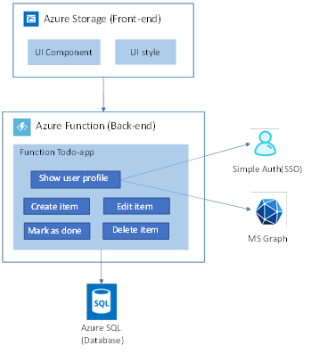
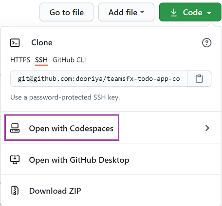
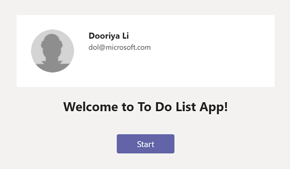
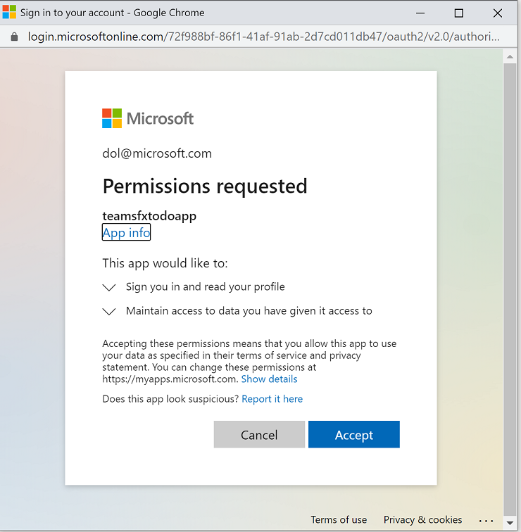
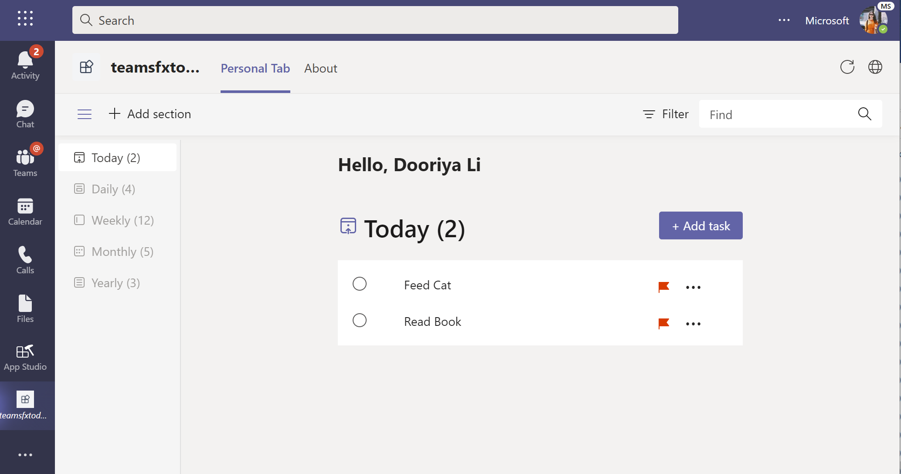

# Todo Sample for Microsoft Teams
Todo sample application for Microsoft Teams built with React and Azure.

Image

## How the App Works

### This sample app is a personal tab used to manage To-do List.

- The frontend is a react tab hosting on [Azure Storage](https://docs.microsoft.com/en-us/azure/storage/).
- Backend server is hosting on [Azure Function](https://docs.microsoft.com/en-us/azure/azure-functions/) and define the logic to manage todo list. 
- And there is a [SQL DB](https://docs.microsoft.com/en-us/azure/azure-sql/) on Azure to persist data so that each time user open the tab can retrieve the same data.
- The app also handles authenticattion and consent user to use Graph API to retrive the user's profile.

## How to Run the App in CodeSpace
### Prerequisite
A GitHub CodeSpace account to create a CodeSpace instance from this sample app repo. You can reruest an early access from [here](https://github.com/features/codespaces).

1. In the sample app repo, click the **Code** drop-down menu, select **Open With CodeSpaces**, and then select **New CodeSpace**.

    

2. It will take a few minutes to build the container for the CodeSpace instance. And the VS Code browser editor will be launched in your browser after your CodeSpace is up and running.
3. Press `F5` to start running the Teams app in CodeSpace locally.
4. A sign in window will be poped up, and you need to sign in with your M365 account so that the TeamsFx toolkit can provision required resources (including AAD app, Teams App manifest) for you.
5. After all components (frontend & backend) are built and running. The Teams Web client will be launch in your browser to sideload your Teams app, and you need to click **Add** button to test the app.

## How to Use the ToDo App
1. The app should be running like this, and you could click the start button:

    

2. For the first time to run the app, you need to consent the app to get your profile information like your avatar. Click on "Accept" button to accept the Authorization.

    

3. You could try to add new todo item by typing item and click **Add task** button.

    

4. You could try to complete todo item by choosing the checkbox before the item.
5. You could try to update todo item by typing text in todo item list.
6. You could try to delete todo item by clicking "..." and then choose **delete*** button.
